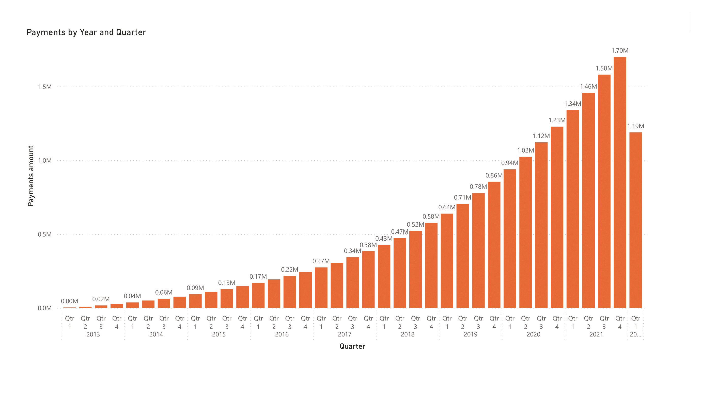

# Business-Analytics
## Project Summary 
The goal of this repository is to present an end-to-end process to organize a dataset and provide advanced business insights and analytics about it. First, we create a schema to organize our data. Then, we present business analytics and insights from the dataset. Also, based on our findings, some business recommendations are suggested. The dataset belongs to a mobile application that allows riders to use the app to unlock a bike at different stations. The dataset consists of information about trips, customers, stations, and customers' payments. To organize the data, we create a database and ETL pipeline. Then, we provide comprehensive business analytics about the dataset.
## Database Schema 
Based on the given dataset, we propose the following schema to organize the data:


To implement our schema, we apply the following steps: 
- 1. the required tables are created  according to the proposed schema as follows: 
```
create table if not exists payements (
       payment_id int primary key, 
       date timestamp, 
       amount numeric , 
       customer_id int,
       FOREIGN KEY (customer_id) REFERENCES customers(customer_id))

create table if not exists customers(
       customer_id primary key,
       name varchar,
       surname varchar,
       address text,
       birth_date date,
       start_date timestamp,
       end_date timestamp,
       member text)

create table if not exists stations(
       station_id primary key,
       name text, 
       latitude numeric, 
       longitude numeric)
       
create table if not exists trips(
       trip_id primary key,
       bike_type varchar,
       start_date timestamp,
       end_date timestamp,
       start_station text,
       end_station text,
       customer_id int,
       FOREIGN KEY (customer_id) REFERENCES customers(customer_id),
       FOREIGN KEY (start_station) REFERENCES stations(station_id),
       FOREIGN KEY (end_station) REFERENCES stations(station_id))
```
- 2. Our data is imported to the created tables by using command  \copy target_table from '/path/to/local/filename.csv'. 
## Data Analysis:

- Here, some business insights from the trip dataset are provided via SQL. 
- **Business question: How much time is spent by our customers based on the day of the week**
```
with t_1 as (select  ride_id,started_at, ended_at,
extract(minute from (ended_at-started_at)) as usage_time,
extract(dow from started_at) as day_of_week
from trip)
select day_of_week, sum(usage_time) as time_sum_usage, 
avg(usage_time) as time_avg_usage, count(day_of_week) as num_ride
from t_1
group by day_of_week
order by time_sum_usage desc
```
| Day | time_sum_usage| time_avg_usage| num_ride |
| :---         |     :---:      |          ---: | ---: |
| Saturday   | 2848799     | 17.50306586384861    |  162760|
|Friday     | 2090770       | 15.352086821158986     |  136188|
Sunday      |  1946063      | 17.7740503612235    |   109489
Thursday    | 1746476       |  14.401194000313343  |121273
Monday|1496599|15.783745873717294|94819
Wednesday|1449917|14.485987751146457|100091
Tuesday|1423223|14.554465874460556|97786
- **Business insight: From the above table, mostly, our app is used during the weekend. This suggests that the customers used our product for leisure activity during weekends.**  
- **Business question: At what time of the day our program is used the most (top 5)?**:

```
with t_1 as (select  ride_id,started_at,
extract(hour from (started_at)) as start_hour,
extract(dow from started_at) as day_of_week
from trip)

select day_of_week, start_hour, count(*) as num_ride
from t_1
group by day_of_week, start_hour
order by num_usage desc
limit 5 
```
| Day | start_hour| num_ride |
| :---         |     :---:      |      ---: |
| Thursday  | 17     | 13516  
|Friday     | 17      | 13246  
Saturday      |  14      | 12990
Saturday   | 13       |  12954 
Saturday|12|12605
- **Business insight: we can observe that Saturday 12-14 pm and Friday 17pm are among the top 5, which confirms our previous insight i.e. customers use our app for leisure activity in their spare time. Interestingly, Thursday at 17pm is the rank first, which suggests that most likely our customers used the product to go home after the job. But, let's dig into our data and find top 5 stations, where our customers started their trip on Thursday at 17pm.**
```
with t_1 as (select  ride_id,started_at, start_station_name,
extract(hour from (started_at)) as start_hour,
extract(dow from started_at) as day_of_week
 from trip)

select start_station_name, count(start_station_name) as num_station
from t_1
where start_hour=17 and day_of_week=4
group by start_station_name
order by num_station desc
limit 5
```
| Station_name | num_ride |
| :---       |     ---: |
|Streeter Dr & Grand Ave |193
| Clinton St & Washington Blvd | 143
| Clark St & Elm St | 117
| Daley Center Plaza | 117
| Millennium Park | 117 
- **Bussiness recommendation: We can send promotions during weekends to encourage customers to use our app because our data suggests they are willing to use our app during weekends. Moreover, we can increase the number of product at the above stations to provide better service**.
- **Business question: At which stations our product are highly demanded?**
```
select start_station_name, count(start_station_name) as num_trip
from trip
group by start_station_name
order by num_trip desc
limit 5
```
| Station_name | num_trip |
| :---       |     ---: |
|Streeter Dr & Grand Ave |17013
| Michigan Ave & Oak St | 8409
| Millennium Park | 7653
| Wells St & Concord Ln |6939
| Theater on the Lake | 6926
- **Bussiness insight: The above stations generally are our main stations, where we may increase our product to improve our service.**
- **Bussiness question: casual customers or member ones, which one is more active?**
```
select member_casual, count(member_casual) as num_member
,avg(extract(minute from (ended_at-started_at))) as avg_trip_duration
from trip
group by member_casual
```
| customer_type | num_customer | average_trip_duration
| :---       |     ---: | ---: |
|causal |442054|18.49|
| member | 380352|12.68|
- **Business insight: As we can observe, the number of our casual customers is more than our members. Also, casual members spent more time with our products.**
- **Business recommendation: The result implies that we couldn't convince our members to use our products more than causal customers. Therefore, we should focus on presenting more incentives to our customers. Moreover, we should try to make our casual customers to members by sending promotions and discounts. To do this, first, we need to know at what time casual customers and members are mostly active, then we can send our promotions/discounts at that time to gain the maximum attention. Hopefully, this strategy leads to more efficient marketing.**
```
with t_1 as (select  ride_id,
extract(hour from (started_at)) as usage_time
from trip
where member_casual='casual')
select usage_time, count(usage_time) as num_usage_time
from t_1
group by usage_time
order by num_usage_time desc
```
| hour | num_trip |
| :---       |     ---: |
|17 |38729
| 18 | 37968
| 16| 33377
| 19 |31416
| 15 | 30787
- **Business recommendation: From 15-19 pm, our app has the maximum exposure by casual customers. Thus, we can send our discounts to them to encourage them to subscribe to our services. The same result is also obtained for members.** 
## Data Visualization 
- In this section, we provide business insights through data visualization via Power BI. 
- First, we check in which regions our customers live. The figure below shows that most of them are from USA, Western Europe and Eastern South America.
 
- Second, we track the number of active customers per quarter and year. From, the below figure, it is clear that we could increase the number of customers year after year and quarter after quarter.
 
- Third, we track the customer's payment amount per quarter and year. From the below figure, our sales increased monotonically year after year and quarter after quarter. Please note that only two months of the first quarter of 2022 are included in the dataset. Thus, the drop in 2022 is not a concern. Both figures imply that our app has been growing steadily over the last nine years.
 
- Fourth, we try to reveal the difference between casual customers' and members' behavior. The following figure illustrates the different behavior of casual customers and members. The figure shows the average payment amount versus days of the week over the last nine years. Members spent more money on Thursday, Saturday, and Friday. However, casual members spent more money on Saturday, Tuesday, and Sunday. 
 
- Fifth, we explore the age of our customers. The chart illustrates that most of the customers are between 20 years old to 35 years old. Thus, our customers are young. **In conclusion, if we advertise our app through social networks, most likely we can gain better attention.** 
 
From the third figure, we already know that a noticeable amount of our current customers started using our app recently. The below Donut chart shows that 50% of our customers started using the app less than 3 years ago. Consequently, our app gets more attention recently.
 
 - Finally, we explore which type of the customers create more money for us so far. 
 The pie chart implies that customers with 3,4,2 years of membership are the most important customers. Also, we can observe that very old customers (with 9 years of membership) didn't generate a noticeable value over years. **Business recommendation: This shows that we have some clients who left the app despite the recent remarkable growth. Therefore, churn analysis is required and the marketing team should focus on reactivating those old customers. Also, the team should pay attention to the other old customers such as those with 8 or 7 years of membership to prevent them from churn.**  


## Advanced Analytics: 
In this section, based on customers’ purchase behaviors’, we predict how many purchases each customer will do over the next 6 months, and calculate the expected profit for each customer. To end this, we leverage BG-NBD and Gamma-Gamma Models, which are statistical models (https://brucehardie.com/notes/004/bgnbd_spreadsheet_note.pdf). 

The BG-NBD model models each customer’s purchase behaviors’ distribution and predict the expected number of purchases for each customer.  The model requires three pieces of information about each customer’s past
purchasing history:his “recency” (when his last transaction occurred), “frequency” (how many transactions he made in a specified time period), and
the length of time over which we have observed his purchasing behavior. The Gamma-Gamma model models the expected average profit distribution and predicts the expected average profit for each customer. Based on the output of the model, the customers are segmented into four different groups. Then, business insights and recommendations are provided regarding each group. 

The below chart illustrates, the expected average of purchases from four customer groups over the next six months. From the chart, group A is the most valuable customer because the gap between the aforementioned group and groups B and C is noticeable. It is expected that each customer in group A on average spend 522 $ over the next six months. However, customers in group D on average only spend 15 $. **Bussiness recommendation: the marketing team should try to reactivate customers group D by sending promotions and discounts. Also, they should try to intrigue customers in groups B and C to increase their app usage. Finally, they should monitor customers in group A, and pay attention to any change in their purchase pattern.**

